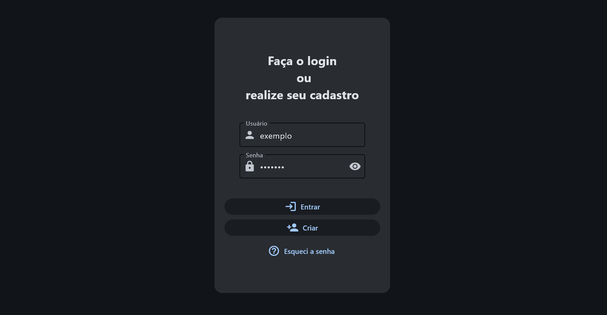
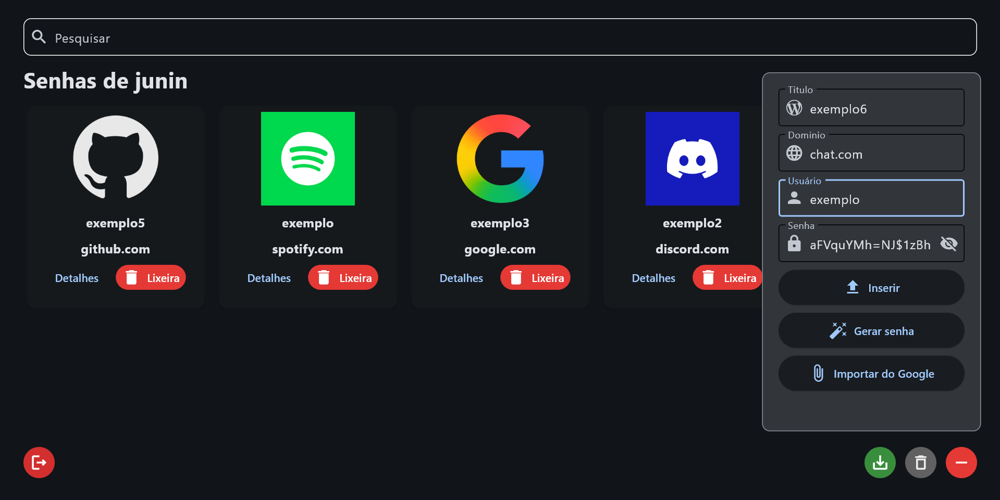
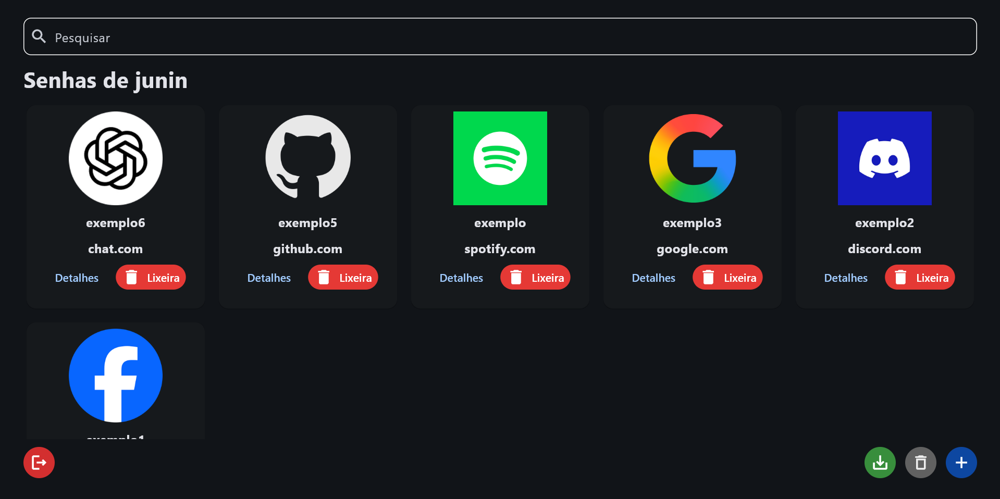

# Gerenciador de Senhas 🔐


**Gerenciador de senhas desktop** construído com **Flet** e **cryptography** para armazenamento local seguro de credenciais. Projeto modular, leve e pensado para aprendizado e uso pessoal.

---

## 🔎 Visão geral

- Interface gráfica com Flet (Dark Mode)
- Armazenamento local com criptografia (módulo `app/core/database`)
- Telas: Login, Home, Lixeira (histórico)
- Arquitetura organizada em `app/ui` (UI) e `app/core` (lógica)
- Sistema de estado centralizado (`app_state.py`) para sincronização de dados
- Componentes reutilizáveis para melhor manutenibilidade

---

## ✅ Principais funcionalidades

- Adicionar, listar, editar e remover entradas de senha
- Autenticação por tela de login com validação
- Histórico (lixeira) para recuperação de senhas deletadas
- Criptografia completa localmente para dados sensíveis
- Busca e filtro de credenciais
- Interface responsiva e intuitiva
- Arquitetura modular para facilitar manutenção e extensibilidade
- Suporte para empacotamento como executável standalone

---

## 📦 Requisitos

- Python 3.10+
- Dependências em `requirements.txt` (Flet, cryptography)
- Testado em Windows (Flet é multiplataforma)

---

## 🚀 Instalação (Windows)

1. Criar e ativar virtualenv:

```powershell
python -m venv .venv
.venv\Scripts\Activate
```

2. Instalar dependências:

```powershell
pip install -r requirements.txt
```

3. Executar a aplicação:

```powershell
python main.py
```

---

## 📦 Empacotamento (opcional)

Exemplo com PyInstaller:

```powershell
pyinstaller --onefile --windowed --icon=app\assets\icon.ico main.py
```

Ou usar o arquivo `GerenciadorSenhas.spec` já presente no projeto.

> Observação: verifique paths relativos ao incluir ícones e arquivos estáticos.

---

## 📁 Estrutura do projeto

```
main.py
requirements.txt
GerenciadorSenhas.spec
app/
  assets/
  core/
    database/
      opDB.py
      verificacao.py
  ui/
    app_state.py
    components/
      game_card.py
    pages/
      login_page.py
      home_page.py
      lixeira_page.py
```

---

## 🔒 Segurança e boas práticas

- Faça backup seguro do banco de dados criptografado.
- Mantenha a dependência `cryptography` atualizada e audite pacotes regularmente.

---

## 🖼️ Screenshots





---
